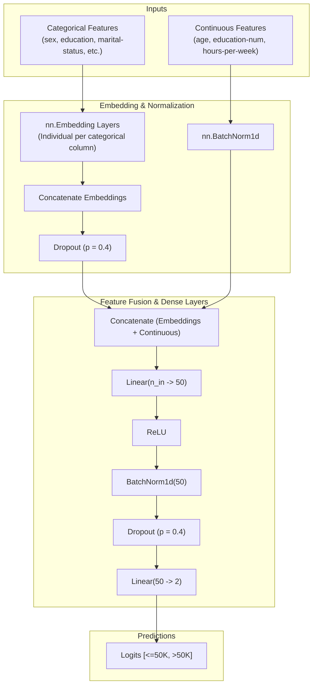

# workshop-1
# Binary Classification with Neural Networks on the Census Income Dataset

[](https://colab.research.google.com/github/AthulKrishna47/Binary-Classification-with-Neural-Networks/blob/main/Workshop.ipynb)


A deep learning implementation using **PyTorch** to predict whether an individual's annual income exceeds **$50,000** based on demographic and employment attributes from the 1994 US Census Bureau database.

This project demonstrates tabular deep learning best practices, including **Entity Embeddings** for categorical features, **Batch Normalization**, and **Dropout** regularisation.

---

## Table of Contents

- [Overview](#overview)
- [Key Features](#key-features)
- [Architecture](#architecture)
- [Dataset](#dataset)
- [Hyperparameters & Training](#hyperparameters--training)
- [Results & Performance](#results--performance)
- [Repository Structure](#repository-structure)
- [Getting Started](#getting-started)
  - [Prerequisites](#prerequisites)
  - [Installation](#installation)
  - [Running the Notebook](#running-the-notebook)
- [Inference Pipeline](#inference-pipeline)
- [License](#license)

---

## Overview

Tabular datasets often contain a mix of continuous measurements and high-cardinality categorical variables. While tree-based algorithms (such as XGBoost or LightGBM) are commonly used, deep neural networks with **learned embeddings** can capture rich non-linear interactions across high-dimensional feature spaces.

This repository implements a custom PyTorch tabular neural network (`TabularModel`) that:
1. Projects categorical features into continuous embedding spaces.
2. Normalizes numerical inputs via 1D Batch Normalization.
3. Fuses categorical representations and numerical features into dense feedforward layers.
4. Outputs classification logits for binary classification (`<=50K` vs `>50K`).

---

## Key Features

- **Dynamic Entity Embeddings**: Automatically computes optimal embedding dimensions for categorical variables based on category cardinality:
  $$\text{Embedding Dimension} = \min\left(50, \left\lfloor\frac{\text{Cardinality} + 1}{2}\right\rfloor\right)$$
- **Effective Regularization**: Leverages both feature-level and hidden-layer Dropout ($p = 0.4$) alongside Batch Normalization to mitigate overfitting.
- **End-to-End Pipeline**: Includes complete data ingestion, preprocessing, training loop, validation, and an interactive inference function for single-sample prediction.
- **Colab Ready**: Self-contained Jupyter Notebook (`Workshop.ipynb`) pre-configured to run directly in Google Colab or on a local machine.

---

## Architecture

The diagram below illustrates the end-to-end forward pass through `TabularModel`:



---

## Dataset

The model is trained on `income.csv`, derived from the **Adult Census Income** dataset (1994 US Census Bureau). It contains **30,000 records** split into:
- **Training Set**: 25,000 samples
- **Test Set**: 5,000 samples

### Feature Dictionary

| Feature Name | Type | Description | Values / Range |
| :--- | :--- | :--- | :--- |
| `age` | Continuous | Age of the individual | 17 – 90 years |
| `sex` | Categorical | Gender | `Male`, `Female` |
| `education` | Categorical | Highest educational qualification achieved | `Bachelors`, `HS-grad`, `Masters`, etc. |
| `education-num` | Continuous | Standardized numerical code for education | 1 – 16 |
| `marital-status` | Categorical | Marital status | `Married`, `Never-married`, `Divorced`, etc. |
| `workclass` | Categorical | Employment sector | `Private`, `Local-gov`, `Self-emp`, etc. |
| `occupation` | Categorical | Professional specialty | `Exec-managerial`, `Prof-specialty`, etc. |
| `hours-per-week` | Continuous | Average working hours per week | 1 – 99 hours |
| **`label`** | **Target (Binary)** | **Income threshold indicator** | **`0` ($\le \$50\text{K}$)**, **`1` ($> \$50\text{K}$)** |

---

## Hyperparameters & Training

| Parameter | Value | Description |
| :--- | :--- | :--- |
| **Optimizer** | `Adam` | Adaptive moment estimation optimizer |
| **Learning Rate** | `0.001` | Initial learning rate |
| **Loss Function** | `CrossEntropyLoss` | Multi-class cross entropy for 2 classes |
| **Hidden Layers** | `[50]` | Single hidden layer with 50 units |
| **Dropout Rate** | `0.4` | Applied post-embeddings and post-hidden layer |
| **Batch Normalization** | Enabled | Applied to continuous features & hidden layer |
| **Epochs** | `300` | Full training iterations |
| **Random Seed** | `42` | Seed for reproducibility across PyTorch and NumPy |

---

## Results & Performance

The model achieves strong generalization and stable convergence across 300 epochs:

| Metric | Value |
| :--- | :--- |
| **Final Training Loss** | `0.3092` |
| **Test Loss** | `0.2936` |
| **Test Accuracy** | **87.10%** |

### Training Convergence

The training loss steadily decreases from `0.7377` at epoch 1 to `0.3092` at epoch 300 without signs of severe overfitting:


### Evaluation Metrics

Evaluation performed on 5,000 unseen test records:


### Sample Single-Instance Prediction

Using the custom inference function, the model correctly predicts high-income classification for a professional profile:


---

## Repository Structure

```text
Binary-Classification-with-Neural-Networks/
├── income.csv           # Census dataset containing 30,000 tabular records
├── Workshop.ipynb       # End-to-end Jupyter Notebook with data processing, model, & training
├── requirements.txt     # Python package dependencies
└── README.md            # Comprehensive project documentation
```

---

## Getting Started

### Prerequisites

Ensure you have **Python 3.8+** installed along with `pip`.

### Installation

1. **Clone the repository:**
   ```bash
   git clone https://github.com/AthulKrishna47/Binary-Classification-with-Neural-Networks.git
   cd Binary-Classification-with-Neural-Networks
   ```

2. **Create and activate a virtual environment (recommended):**
   - **Linux / macOS:**
     ```bash
     python3 -m venv venv
     source venv/bin/activate
     ```
   - **Windows:**
     ```powershell
     python -m venv venv
     .\venv\Scripts\Activate.ps1
     ```

3. **Install dependencies:**
   ```bash
   pip install -r requirements.txt
   ```

### Running the Notebook

Launch JupyterLab or Jupyter Notebook:
```bash
jupyter notebook Workshop.ipynb
```
Or click the badge at the top to open and execute directly in **Google Colab**.

---

## Inference Pipeline

The repository provides an intuitive inference routine to classify individual demographic profiles:

```python
import torch

def predict_income(single_data, model, df, cat_cols, cont_cols):
    """
    Predicts income class (<=50K or >50K) for a single record dictionary.
    """
    model.eval()

    # Map categorical values using pandas category encoding
    cat_indices = [
        df[col].dtype.categories.get_loc(single_data[col])
        for col in cat_cols
    ]
    cat_tensor = torch.tensor([cat_indices], dtype=torch.int64)

    # Format continuous values
    cont_vals = [single_data[col] for col in cont_cols]
    cont_tensor = torch.tensor([cont_vals], dtype=torch.float32)

    with torch.no_grad():
        logits = model(cat_tensor, cont_tensor)
        predicted_class = torch.max(logits, 1)[1].item()

    label_map = {0: "<=50K", 1: ">50K"}
    return label_map[predicted_class]

# Example query:
sample_profile = {
    'sex': 'Male',
    'education': 'Masters',
    'marital-status': 'Married',
    'workclass': 'Private',
    'occupation': 'Exec-managerial',
    'age': 45,
    'education-num': 14,
    'hours-per-week': 50
}

result = predict_income(sample_profile, model, df, cat_cols, cont_cols)
print(f"Predicted Income Bracket: {result}")
# Output: Predicted Income Bracket: >50K
```

---

## License

This project is licensed under the [MIT License](LICENSE) — feel free to modify and use it for educational and commercial purposes.
